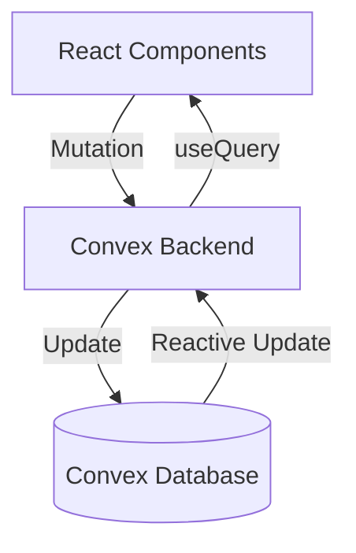

# Architecture Document: uyuk

This document outlines the technical architecture for uyuk, a habit tracking web application built with modern reactive technologies.

## Tech Stack

- Framework: TanStack Start (React, File-based routing, SSR)
- Database/Backend: Convex (Reactive, real-time, serverless)
- Auth: Convex Auth with Google OAuth
- Styling: Tailwind CSS v4
- Deployment: Vercel
- Language: TypeScript (Strict mode)

## Data Model (Convex Schema)

The database schema is defined in `convex/schema.ts`. We use a relational approach where habits and completions are distinct tables. User settings are embedded within the `users` table to reduce join complexity for global preferences.

```typescript
import { defineSchema, defineTable } from "convex/server";
import { v } from "convex/values";
import { authTables } from "@convex-dev/auth/server";

export default defineSchema({
  ...authTables,
  // Note: Convex Auth provides a `users` table via authTables.
  // We extend it with custom fields using a patch approach:
  // In auth.ts, use the `afterUserCreated` callback to set defaults.
  // Custom user settings are stored directly on the users table.
  // Fields added to users: timezone, weekStartDay, tableViewDayCount

  habits: defineTable({

  habits: defineTable({
    userId: v.id("users"),
    name: v.string(),
    description: v.optional(v.string()),
    iconType: v.union(v.literal("emoji"), v.literal("icon")),
    iconValue: v.string(), // emoji character or icon name
    color: v.string(), // hex code
    type: v.union(v.literal("boolean"), v.literal("numeric")),
    target: v.number(), // completion count for boolean, target value for numeric
    sortOrder: v.number(),
    isArchived: v.boolean(),
    isDeleted: v.boolean(),
    createdAt: v.number(),
    updatedAt: v.number(),
  }).index("by_user_active", ["userId", "isDeleted", "isArchived", "sortOrder"]),

  completions: defineTable({
    userId: v.id("users"),
    habitId: v.id("habits"),
    date: v.string(), // Format: YYYY-MM-DD
    value: v.number(),
    createdAt: v.number(),
    updatedAt: v.number(),
  })
    .index("by_habit_date", ["habitId", "date"])
    .index("by_user_date", ["userId", "date"])
    .index("by_user_habit", ["userId", "habitId"]),
});
```

## File Structure

The project uses a single package structure optimized for TypeScript performance and feature isolation.

```text
/
├── app/                  # TanStack Start application root
│   ├── routes/           # File-based routing
│   │   ├── (auth)/       # Authenticated layout group
│   │   │   ├── index.tsx # Redirects to /table
│   │   │   ├── table.tsx # Table view
│   │   │   ├── grids.tsx # Grid/Heatmap view
│   │   │   └── settings.tsx
│   │   ├── auth.tsx      # Login page
│   │   └── __root.tsx    # Root layout with providers
├── components/           # React components
│   ├── ui/               # Base UI primitives (buttons, inputs)
│   ├── habits/           # Habit-specific components (Form, Card)
│   ├── grid/             # Heatmap and grid visualizations
│   ├── table/            # Table view rows and cells
│   └── layout/           # App shell, navigation
├── convex/               # Backend functions
│   ├── auth.ts           # Auth configuration
│   ├── habits.ts         # Habit CRUD mutations and queries
│   ├── completions.ts    # Logging logic
│   ├── users.ts          # Settings and profile
│   ├── schema.ts         # Database definition
│   └── _generated/       # Convex generated types
├── hooks/                # Custom React hooks (useHabits, useStreak)
├── lib/                  # Utilities (date formatting, constants)
├── public/               # Static assets
└── styles/               # Tailwind v4 entry point
```

## Routing (TanStack Router)

Navigation is handled via file-based routing. Authenticated routes are grouped to share layout and auth checks.

- `/` : Root redirect logic.
- `/auth` : Unauthenticated entry point for Google OAuth.
- `/table` : Primary interaction view. Lists habits as rows and days as columns.
- `/grids` : Visual analysis view. Shows 1-month heatmaps per habit.
- `/settings` : User profile and app preferences.
- `/habits/new` : Creation interface (Modal on desktop, Page on mobile).
- `/habits/$id/edit` : Management interface.

## State Management

### Server State (Reactive)

Convex serves as the primary state manager. Queries are reactive, meaning the UI automatically updates when data changes in the cloud. We use `useQuery` for data fetching and `useMutation` for updates.

### Client State

- UI State: Managed via standard React `useState` or `useReducer` for complex interactions like drag-and-drop.
- Form State: `react-hook-form` for habit creation and settings.
- URL State: TanStack Router search params handle view filters (e.g., `?start=2024-01-01`) and modal visibility.

## Convex Functions

### Queries

- `habits:list`: Returns active habits for the user, ordered by `sortOrder`.
- `habits:getById`: Specific habit details.
- `completions:byDateRange`: Fetches all logs between two dates to populate views.
- `stats:getSummary`: Computes streaks and completion rates.

### Mutations

- `habits:create`: Adds new habit with calculated `sortOrder`.
- `habits:reorder`: Batch updates `sortOrder` for a set of habits.
- `completions:upsert`: Handles the "increment" logic for boolean habits or "set" for numeric ones.
- `user:updateSettings`: Updates timezone or week start day.

## Architecture Decisions

### 1. Data Flow



### 2. Habit Log Design

We store one record per habit per day. For boolean habits, the `value` increments. This allows users to track habits they perform multiple times a day (e.g., "Drink 8 glasses of water").

### 3. Streak Calculation

Streaks are computed at query-time within Convex functions. This ensures they are always accurate relative to the user's current timezone without requiring complex "streak maintenance" mutations on every log.

### 4. Drag and Drop

Reordering uses a simple `number` based `sortOrder`. When a habit is moved, we calculate a new index. For high-performance UI, we apply optimistic updates using Convex's internal state before the server confirms.

## Deployment Architecture

- Frontend: Vercel handles the TanStack Start SSR deployment.
- Backend: Convex provides a globally distributed serverless backend.
- CI/CD: GitHub integration with Vercel. Preview branches create unique Convex environments for testing.

Required Environment Variables:

- `CONVEX_DEPLOYMENT`: Convex deployment identifier (set by Convex CLI).
- `VITE_CONVEX_URL`: Public Convex URL for the client.
- `AUTH_GOOGLE_ID`: Google OAuth client ID (set in Convex dashboard).
- `AUTH_GOOGLE_SECRET`: Google OAuth client secret (set in Convex dashboard).
